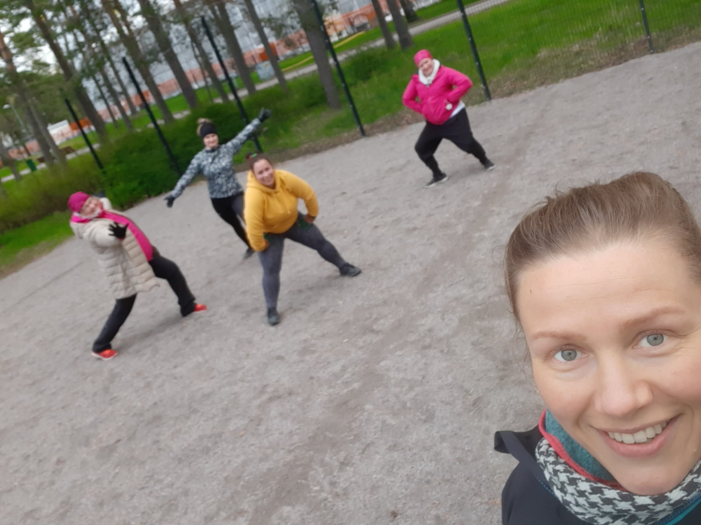

### Muutokseen tähtäävä pienryhmävalmennus Sinun hyvinvointisi tueksi 

LIIKUNNAN ILO - UNI&PALAUTUMINEN - RAVINTO  - HYVINVOIVA KEHO - LEMPEÄMPI ELO

{: .image-right :}
#### Muutosvalmennus  
Kyseessä on pienryhmässä tapahtuva hyvinvointivalmennus elämäntapamuutoksen tueksi. Valmennus tähtää pysyvään muutokseen ja arjen yksilölliseen hyvinvointiin. Pääset rauhassa pysähtymään itsesi ja hyvinvointisi äärelle valmentajan ja ryhmän tuella. Ryhmässä on voimaa, josta jaksaa ammentaa motivaatiota! 

{: .image-left :}

Valmennuksessa käymme läpi
oikeanlaista tavoitteenasettelua ja muutokseen tähtäävää arjen pienien tekojen toteutusta. Pohdimme millä lisätä liikettä,
millainen on ravinnon merkitys hyvinvoinnille, sekä miten tukea omaa unta & palautumista, ja vähentää stressiä. Valmennuksessa
työstämme näitä teemoja luennoin, yhdessä keskustellen, liikkeellä, sekä pienin tehtävin valmennuksessa ja kotona. Valmennukseen sisältyy ryhmätapaamisten lisäksi myös henkilökohtaisia valmennustapaamisia. Valmennus ei sisällä valmiita kirjallisia ohjeita siitä, kuinka sinun tulee syödä/liikkua/nukkua, vaan valmennuksessa opetellaan löytämään oman hyvinvoinnin tekoja pienin askelin, itselle sopivalla tavalla.
  
{: .image-right :}
**Tavoitteena on löytää Sinua tukeva kokonaisuus, jotta sinä voit voida paremmin.
Omat tavoitteesi muutoksen suhteen ovat keskiössä.** Teemme matkaa yhdessä, mutta jokainen omista tavoitteistaan käsin.
Valmennus sisältää arvotyöskentelyä, omien tapojen pohtimista ja tekojen priorisointia, keskustelua, yhteistä liikettä, palautumisen tukemista, oman ravinnon tarkastelua, psyykkistä hyvinvointia, sekä muuta omaan muutokseen tähtäävää prosessia, jota työstät sekä yksin, että yhdessä ryhmän kanssa. Oma tavoitteesi edellä, valmentajan tuella. Kyseessä on pienryhmävalmennus, joten yksilöllisemmän tuen takaamiseksi ryhmään otetaan maksimissaan 6 osallistujaa.
  
{: .center-block :}  

**Tarkemmat tiedot toteutuksesta:** 

Uusi ryhmä käynnistyy tammikuussa 2024!  
Ryhmä kokoontuu 21.1.-16.6.2024 sunnuntaisin klo 18:45-20:00 Liikuntakeskus Ruukissa. Ryhmätapaamiset noin joka toinen viikko.  
Tässä 6 kuukautta kestävässä valmennuksessa saat yhteensä 14 valmennustapaamista; 12 ryhmätapaamista ja 2 henkilökohtaista valmennustapaamista. Lisäksi
ryhmän tuki, sekä valmentajan jatkuva etätuki antavat sinulle paljon lisäbuustia matkallesi. 

[RYHMÄÄN ON 2 VAPAATA PAIKKAA, ILMOITTAUDU MUKAAN TÄSTÄ](https://forms.gle/Gs1xnEhThhFExUgR6){:target="_blank"}

**Valmennus sisältää:**

- Ryhmätapaamiset 2x/kk - 75 min./kerta; Sunnuntaisin klo 18:45-20:00
Aikataulu: 21.1., 28.1., 11.2., 25.2., 10.3., 24.3., 7.4., 21.4., 5.5., 19.5., 2.6., 16.6.
- Henkilökohtaiset valmennustapaamiset 60 min. x2  
    - Oman matkan suunnittelua  
    - Oman liikunnan suunnittelu + henkilökohtainen ohjelma   

- Valmentajan yksilöllinen etätuki koko valmennuksen ajan
- Pääsyn Sportyplanner-ohjelmaan, jossa yksilöllinen treeniohjelma
- Ryhmän oma alusta Facebookissa tai WhatsApp:ssa (ryhmän toiveiden mukaan) keskustelulle ja yhteiselle jakamiselle matkan aikana  

**HINTA:**  
89€/kk TAI 528€ kertamaksulla (hinnat sis. alv).  
Voit maksaa myös liikuntaeduilla (Smartum, Edenred, ePassi, eazybreak).

\* Halutessasi voit ostaa lisää henkilökohtaisia ohjauksia alennettuun hintaan 65€ / 1h ohjaus esim. liikuntaan/palautumiseen/ravitsemukseen (ovh 79€).

[ILMOITTAUDU RYHMÄÄN MUKAAN TÄSTÄ](https://forms.gle/Gs1xnEhThhFExUgR6){:target="_blank"}

**_Elokatsu pidättää itsellään kaikki oikeudet muutoksiin._**
 
[Lue ryhmien valmennusehdot tästä](/valmennusehdot), ostaessasi elokatsun palveluita sitoudut palveluiden valmennusehtoihin. 

{: .center-block :}
> Tule mukaan etsimään yhdessä Sinun arjen hyvinvointia tukevat palikat!