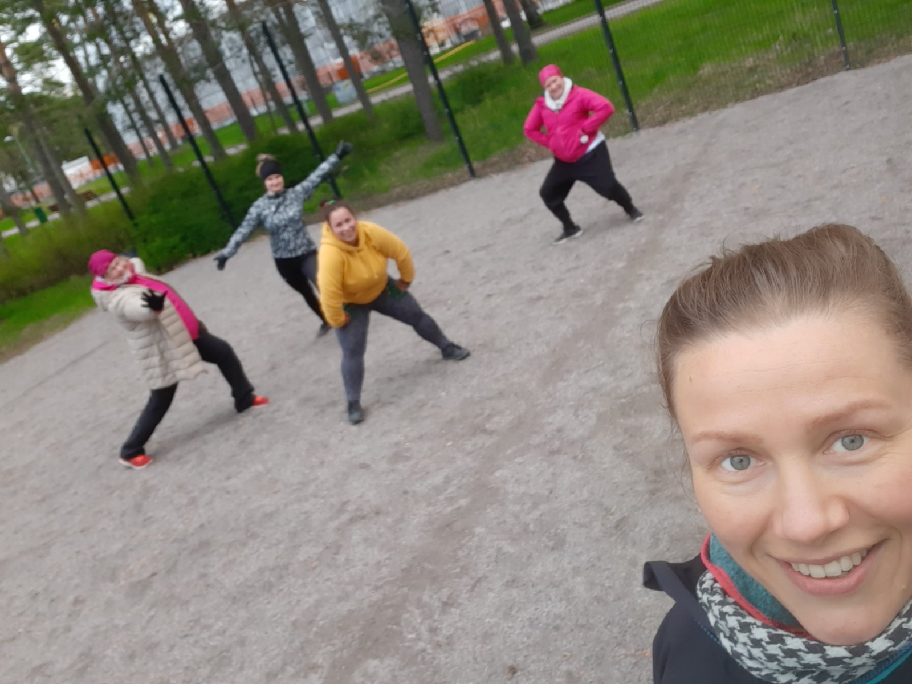

### Muutokseen tähtäävä pienryhmävalmennus Sinun hyvinvointisi tueksi 

LIIKUNNAN ILO - UNI&PALAUTUMINEN - RAVINTO  - HYVINVOIVA KEHO - LEMPEÄMPI ELO

{: .image-right :}
#### Muutosvalmennus  
Kyseessä on pienryhmässä tapahtuva hyvinvointivalmennus elämäntapamuutoksen tueksi. Valmennus tähtää pysyvään muutokseen ja arjen yksilölliseen hyvinvointiin. Pääset rauhassa pysähtymään itsesi ja hyvinvointisi äärelle valmentajan ja ryhmän tuella.  

{: .image-left :}

Valmennuksessa käymme läpi oikeanlaista tavoitteenasettelua ja muutokseen tähtäävien arjen pienten tekojen toteutusta. Opetellaan miten lisätä liikettä arkeen, millainen on ravinnon merkitys hyvinvoinnille, sekä miten tukea omaa unta & palautumista ja vähentää stressiä. Valmennuksessa työstämme näitä teemoja luennoin, yhdessä keskustellen, liikkeellä, sekä pienin tehtävin valmennuksessa ja kotona. Valmennukseen sisältyy ryhmätapaamisten lisäksi myös henkilökohtaisia valmennustapaamisia. Valmennus ei sisällä valmiita kirjallisia ohjeita siitä, kuinka sinun tulee syödä/treenata/nukkua, vaan valmennuksessa opetellaan löytämään omaa hyvinvointiasi tukevia tekoja edeten pienin askelin kohti pysyvää muutosta. Valmennuksen sisältö pohjautuu tieteelliseen tutkimusnäyttöön ja suosituksiin. Tavoitteena on löytää Sinua tukeva kokonaisuus pysyvään muutokseen. Teemme matkaa yhdessä, mutta jokainen omista tavoitteistaan käsin.
  
{: .image-right :}
Kyseessä on pienryhmävalmennus, joten yksilöllisen tuen takaamiseksi ryhmään otetaan maksimissaan 6 osallistujaa. Valmennus sisältää arvotyöskentelyä, omien tapojen pohtimista ja tekojen priorisointia, keskusteluja, yhteistä liikettä, palautumisen tukemista, oman ravinnon tarkastelua, psyykkistä hyvinvointia sekä muutoksen prosessointia, jota työstät yksin ja yhdessä ryhmän kanssa. Kohti omia tavoitteitasi, valmentajan tuella.
  
{: .center-block :}  

**Tarkemmat tiedot toteutuksesta:** 

Ryhmä kokoontuu Wellnex Gymillä välillä tammikuu-kesäkuu 2026, joka toinen sunnuntai klo 18:15-19:30 (11.1., 25.1., 8.2., 22.2., 15.3., 29.3., 12.4., 26.4., 10.5., 24.5., 7.6., 14.6.) - ei haittaa vaikka joutuisit olemaan jollain kerralla poissa, saat tällöin kirjallisen koosteen aiheesta.  

**Valmennus sisältää:**

- Ryhmätapaamiset x12 - 75 min./kerta

- Henkilökohtaiset valmennustapaamiset x2 - 45min./kerta (voit käyttää tapaamiset esimerkiksi keskusteluun, yksilölliseen liikuntasuunnitelmaan, ravintovalmennukseen tms.)

- Valmentajan yksilöllinen etätuki koko valmennuksen ajan käytössäsi

- Ryhmän tuki ja oma alusta WhatsApp:ssa keskustelulle ja yhteiselle jakamiselle matkan aikana, jossa valmentaja myös mukana

- Treeniohjelma salille + Kehonhuolto-ohjelma kotiin (yleisohjelmat) 

**HINTA:**  
89€/kk x6 tai 500€ kertamaksulla (hinnat sis. alv) - voit maksaa laskulla tai liikuntaeduilla (ei muita maksuja, jos haluat käydä itsenäisesti kuntosalilla, tulee sinulla olla salikortti).

[ILMOITTAUDU RYHMÄÄN MUKAAN TÄTÄ LINKKIÄ PAINAMALLA](https://forms.gle/3JuiCodEwCgbBrSZ9){:target="_blank"}

**_Elokatsu pidättää itsellään kaikki oikeudet muutoksiin._**
 
[Lue ryhmien valmennusehdot tästä](/valmennusehdot), ostaessasi elokatsun palveluita sitoudut palveluiden valmennusehtoihin. 

{: .center-block :}
> Tule mukaan etsimään yhdessä Sinun arjen hyvinvointia tukevat palikat!